# Fridge Tracker

Fridge tracker helps you track your fridge and alert if you have items nearing expiry date or has expired.

Some screenshot
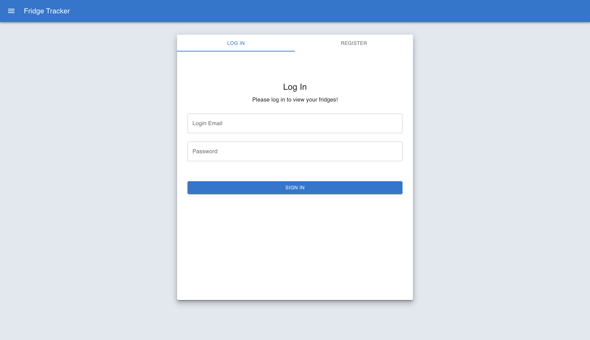
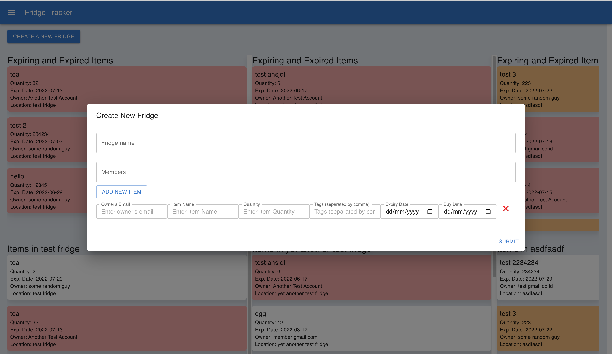
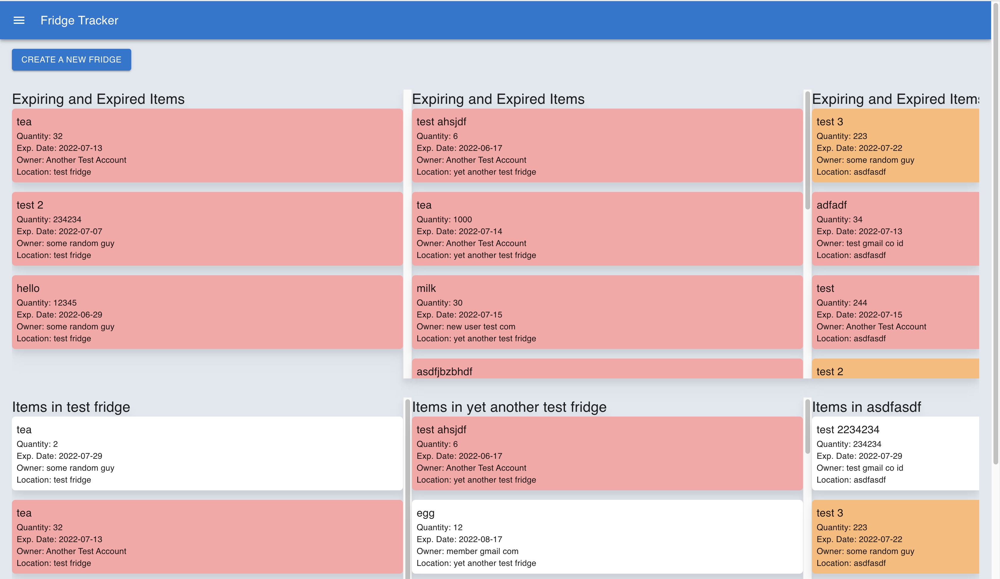
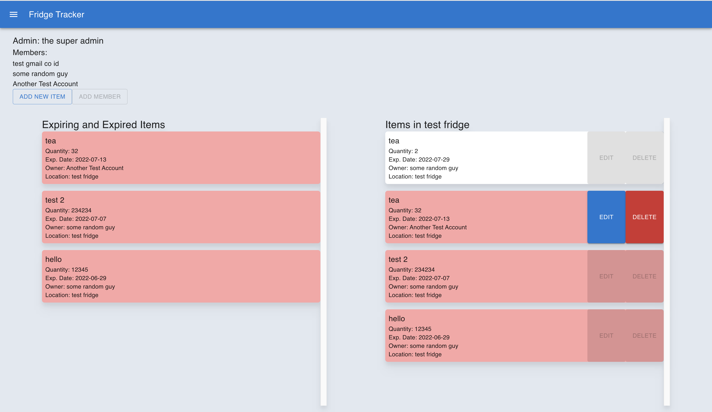

## User Stories

- User should to be able to register and login
- Member and Admin register themselves, then admin can add members in to the fridge
- User should be able to input the item (either by scanning barcode or manual entry, manual entry would be the priority), and the item will be put under the users' items list
- User should be able to update the items in the fridge
- User should be able to see what are inside their fridge
- User should be able to delete items from the fridge
  - member can only delete their own items
  - admin can delete others' items
- User should be alerted for items that near expiry date

## Technologies Used

MERN (MongoDB, Express, React, and Node) Stack

Additional libraries/framework:
Front-end:

- Material UI
- Tailwind CSS
- React Router DOM

Back-end:

- Express Validator for form validation
- JSON Web Token
- Bcrypt to has the password
- Mongoose

## Approach

We tried to complete the back-end first then complete the front-end, but back-end took quite a long time to finish as there are a lot of things to update. We decided to connect whatever endpoint available fron the back-end to the front-end.

For back-end, we did a lot of `.find()` and `.save()` functions a lot when we make data changes in the database.

For front-end, since a lot of components are repeated, we are able to make a reusable components, such as `FridgeComp` which renders the fridge item data and `CreateItem` which generate a new field to enable user to add multiple items at once.

## Installation

To run this web app locally:

1. Clone this project

```
git clone https://github.com/orlinromy/fridge-tracker.git
```

2. Install the packags

```
npm i
```

3. Open 2 terminals:
   - Terminal 1:
     1. `cd server`
     2. `npm i`
     3. `npm run dev` or `nodemon` if you have it installed
   - Terminal 2:
     1. `cd client`
     2. `npm i`
     3. `npm start`

## Wireframes and Other Design

### Backend Design

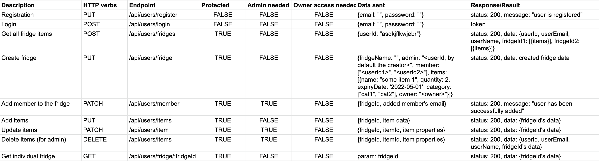

### Wireframes

Initial wireframes:
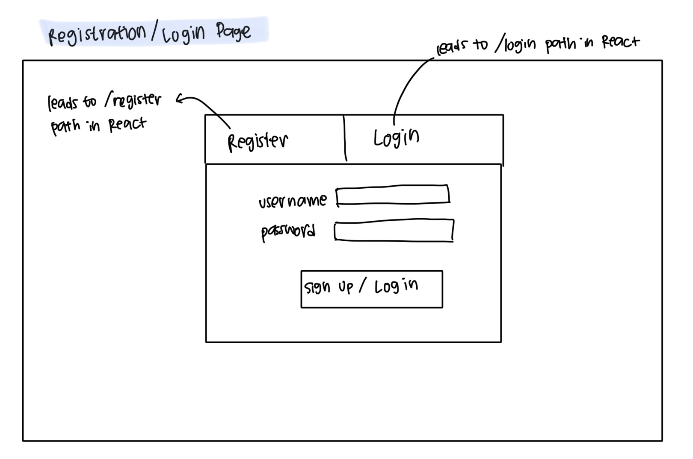
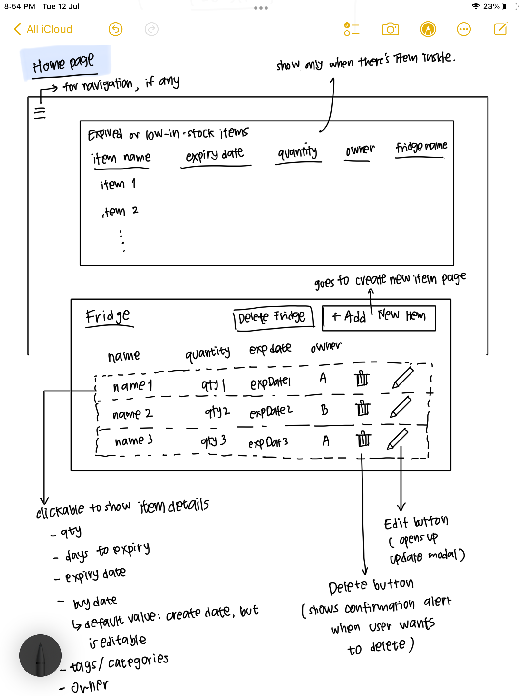
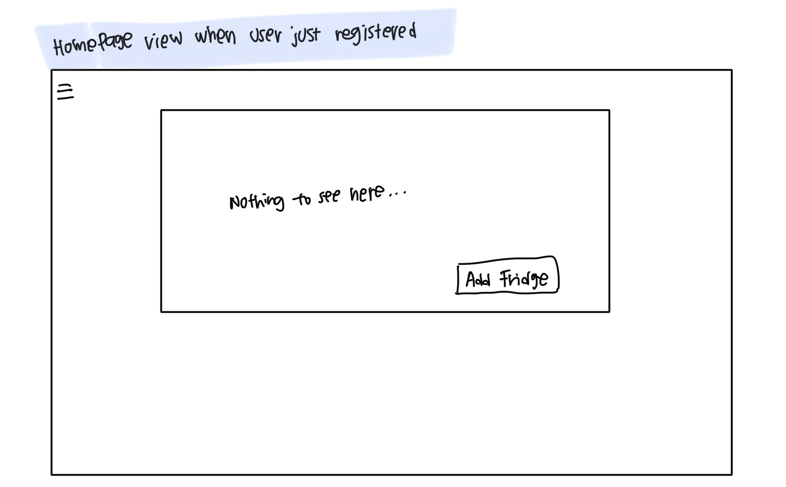
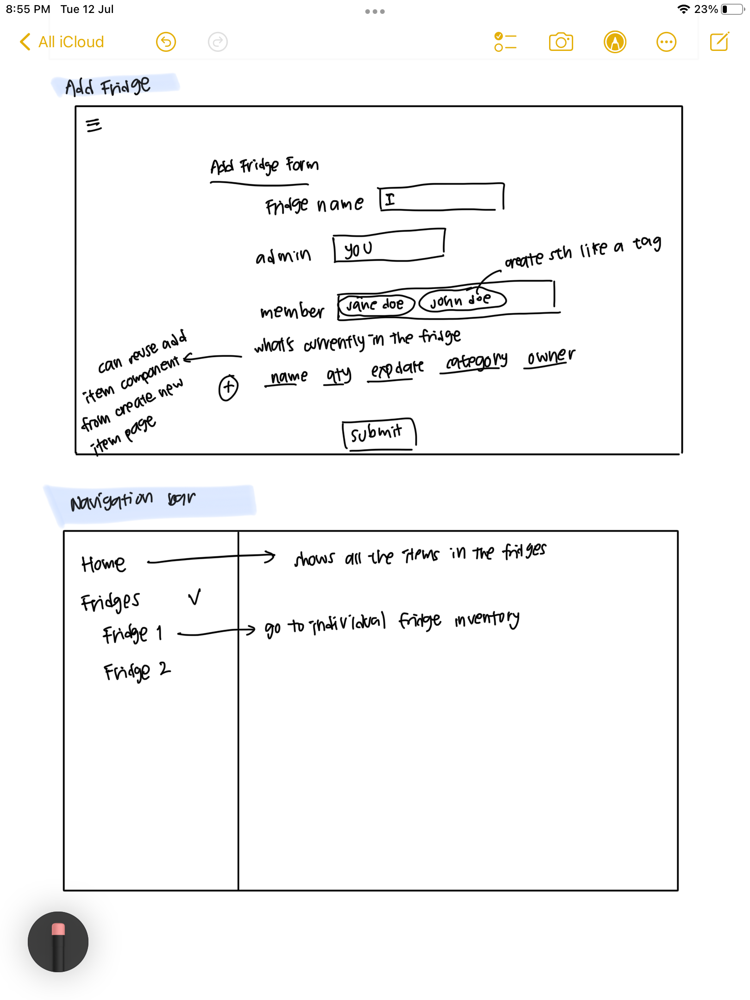
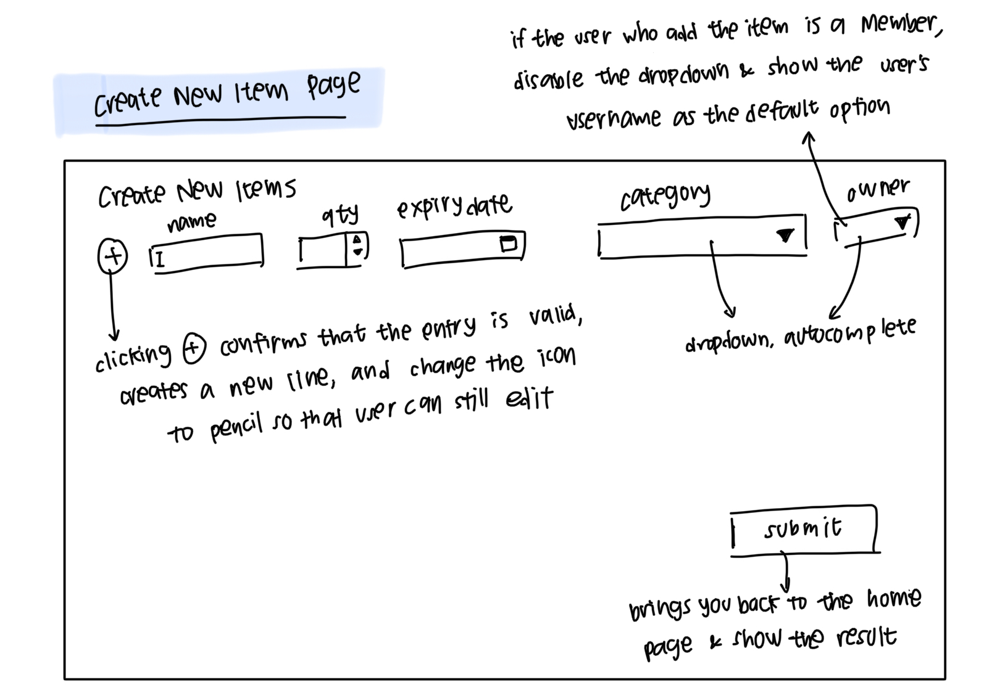

The initial wireframes change so much during the course of the project as we realized that some screens are not covered, such as the individual fridge screen where user can click on one of the fridges in the homepage to see their items in detail. Initially, we wanted to implement the checker and submitter model, where a user would input the item in the fridge and the other user would check whether the items in the fridge are added correctly. However, we changed this model to admin - member model because we feel that this would be more useful for people who are in communal living.

### Models

#### Fridge Model

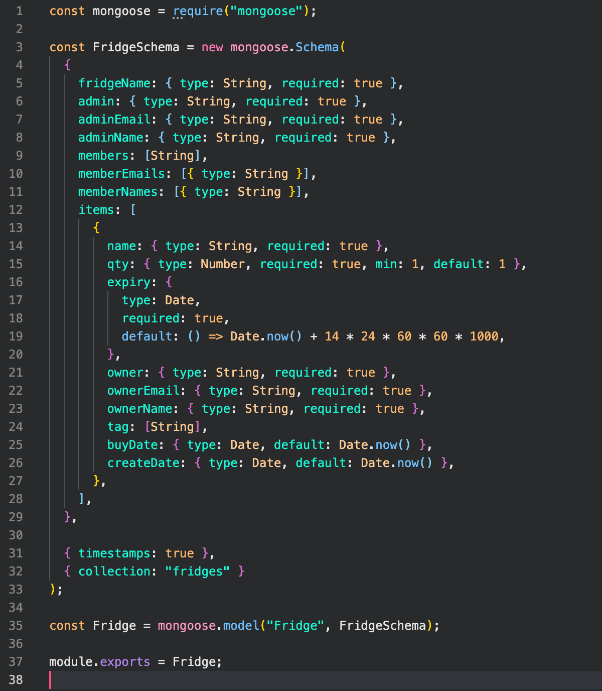

#### User Model

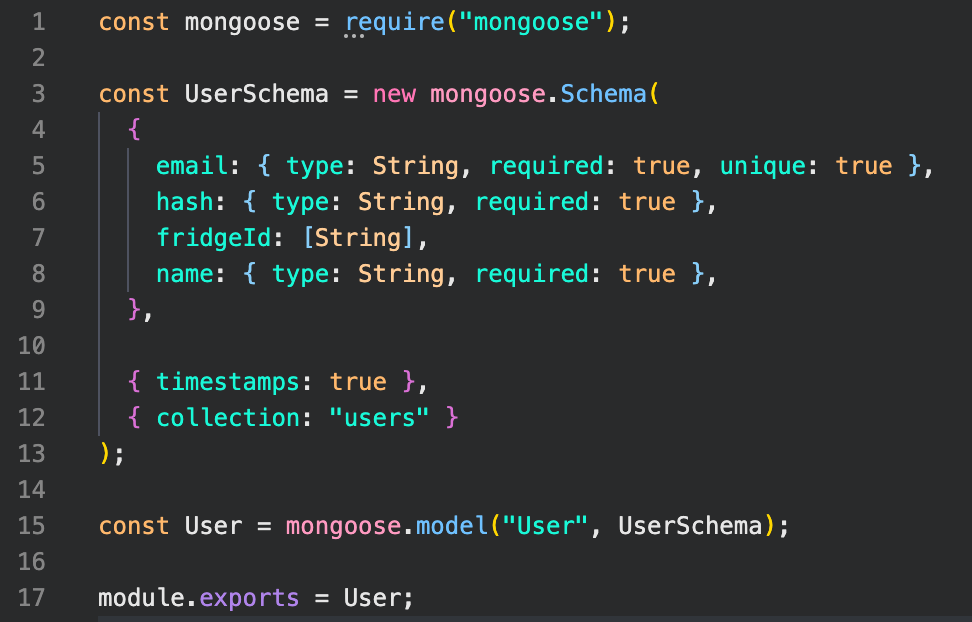

### Major Hurdles

1. Updating both Fridge model and User model

   We designed the model such that when a user created a fridge or is added to a fridge, the fridgeId array in the User model need to be updated to keep track of the fridgeId that they have. What we implemented at the end is to tap into both models when we call the create fridge and add member to fridge endpoint, which resulted in long code.

2. Not using Mongoose's full ability

   A lot of times we decided to do `User.find()` or `Fridge.find()` then call `.save()` method when we want to update or delete something. We could have just used mongoose's function (e.g. `arrayFilter` or `ref`)

3. Design has to be detailed

   Quite self-explanatory. Planning and design is very important for a software project as a lot of things can go wrong.

4. Fetch API works differently from axios
   Not to say that Fetch API is better or axios is better - this is strictly for learning purposes.

   When the backend throw a status 4XX or 5XX, axios would treat that as an error, while Fetch API treat that as a promise rejected (not an error). So if we use axios, the error can be caught in the try-catch section, while in Fetch API, we'll need to check whether the `res.ok` returns true or false - if it's false, we need to throw an error so that it can be caught in the try-catch section.

### Unsolved Problems

- Delete fridge and delete user
- Barcode scan to identify the items
- Admin to send announcement when the admin wants to delete
- Log the activities in the fridge
- Low-in-stock alert

## Acknowledgement

- GA SEI-37 Instructional team and fellow students
- Stack Overflow
- MDN web docs
