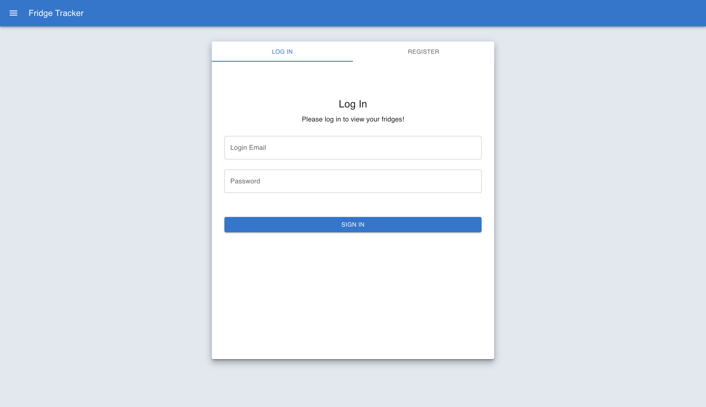
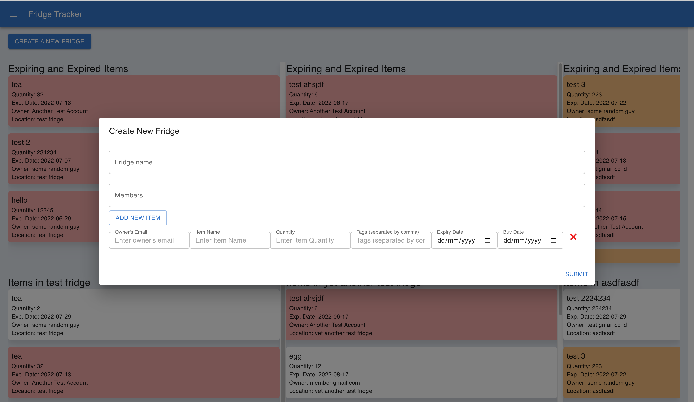
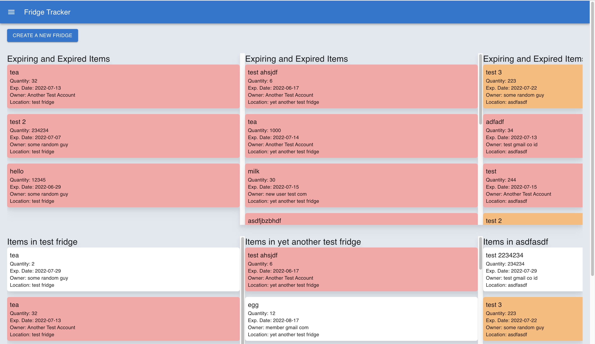
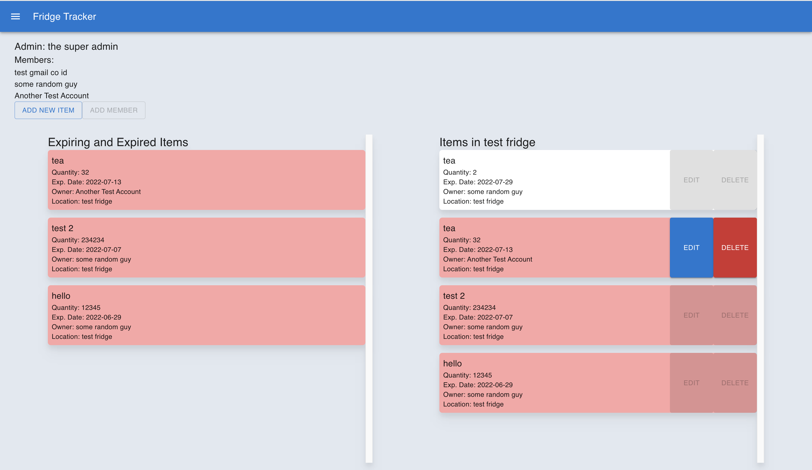
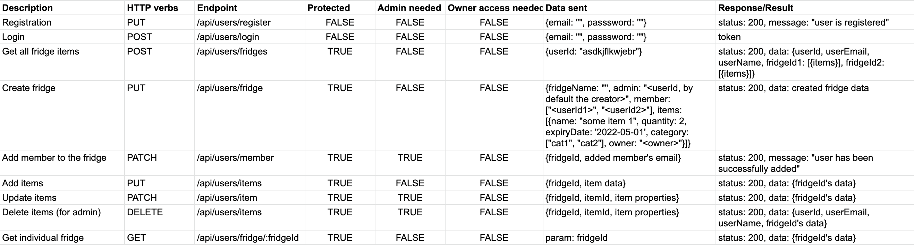
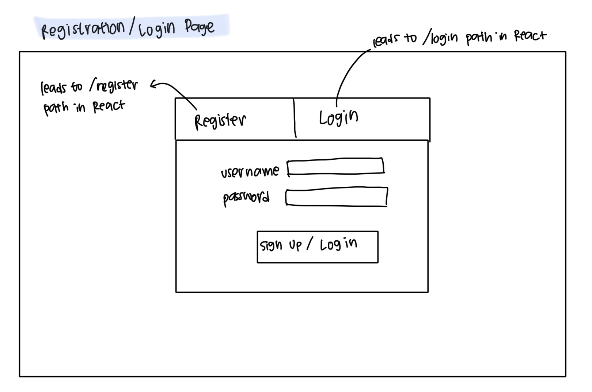
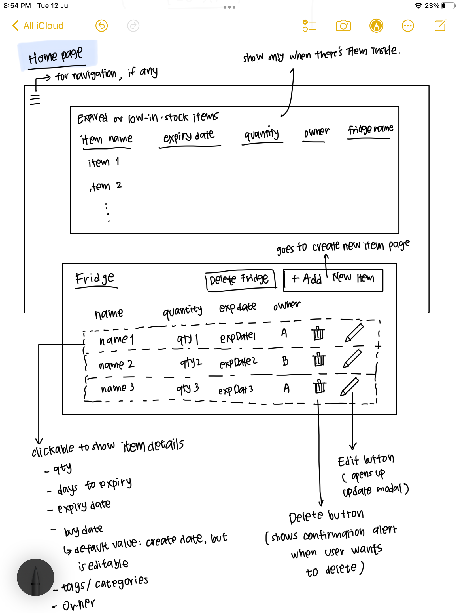
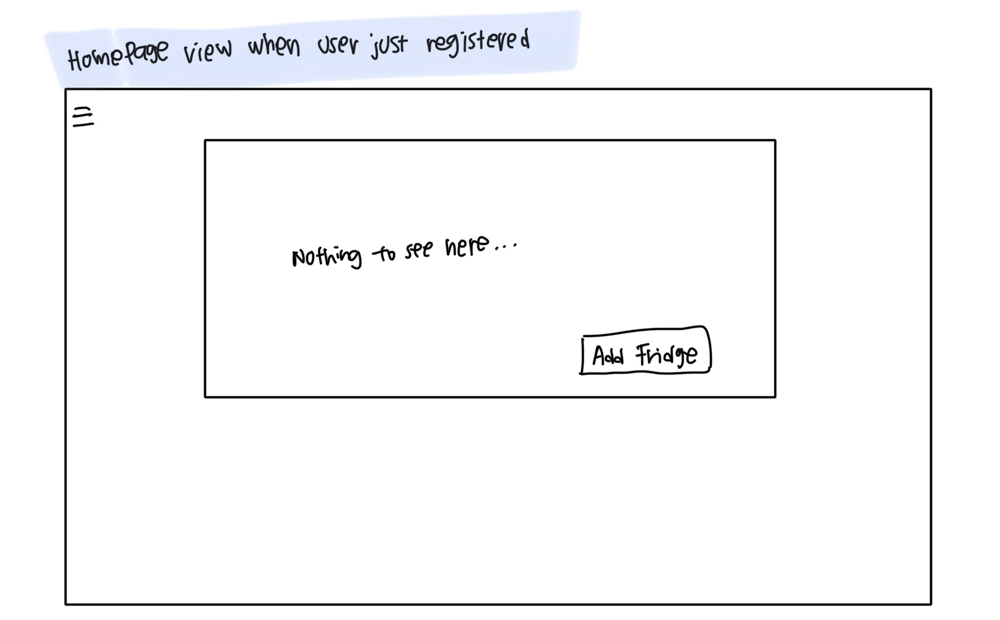
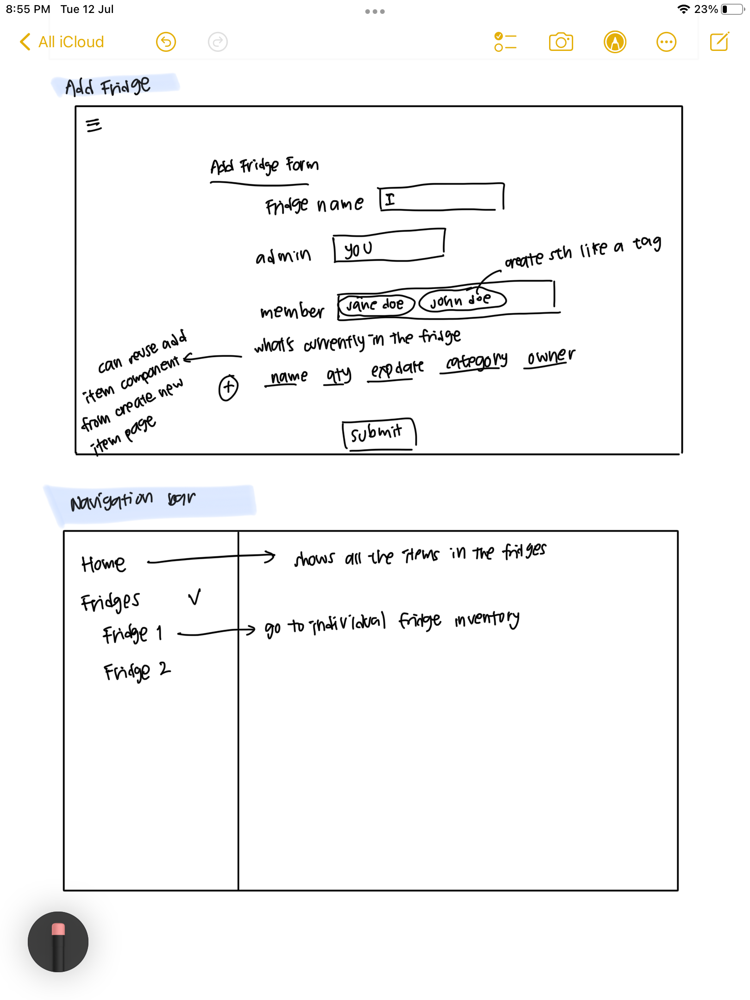
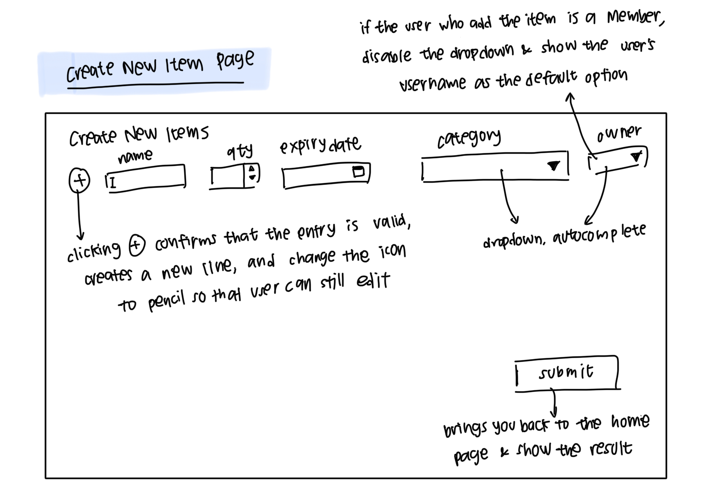

# Fridge Tracker

Fridge tracker helps you track your fridge and alert if you have items nearing expiring or has expired.

Some screenshot





### User Stories

- User should to be able to register and login
- Member and Admin register themselves, then admin can add members in to the fridge
- User should be able to input the item (either by scanning barcode or manual entry, manual entry would be the priority), and the item will be put under the users' items list
- User should be able to update the items in the fridge
- User should be able to see what are inside their fridge
- User should be able to delete items from the fridge
  - member can only delete their own items
  - admin can delete others' items
- User should be alerted for items that near expiry date

### Technologies Used

MERN (MongoDB, Express, React, and Node) Stack
Additional libraries/framework:
Front-end:

- Material UI
- Tailwind CSS
- React Router DOM

Back-end:

- Express Validator for form validation
- JSON Web Token
- Bcrypt
- Mongoose

### Approach

### Installation

1. Clone this project

```
git clone https://github.com/orlinromy/fridge-tracker.git
```

2. Install the packags

```
npm i
```

3. Open 2 terminals:
   - Terminal 1:
     1. `cd server`
     2. `npm i`
     3. `npm run dev` or `nodemon` if you have it installed
   - Terminal 2:
     1. `cd client`
     2. `npm i`
     3. `npm start`

### Wireframes and Other Plannings

#### Backend Design



#### Wireframes







### Major Hurdles

### Unsolved Problems

- Barcode scan to identify the items
- Admin to send announcement when they want to delete
- Log the activities
